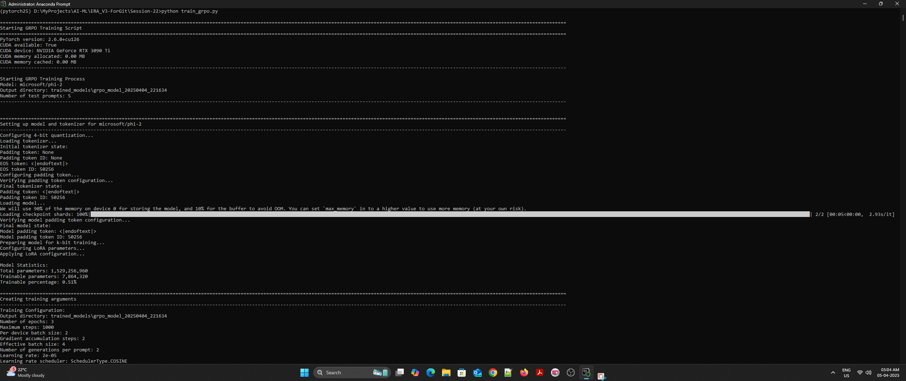
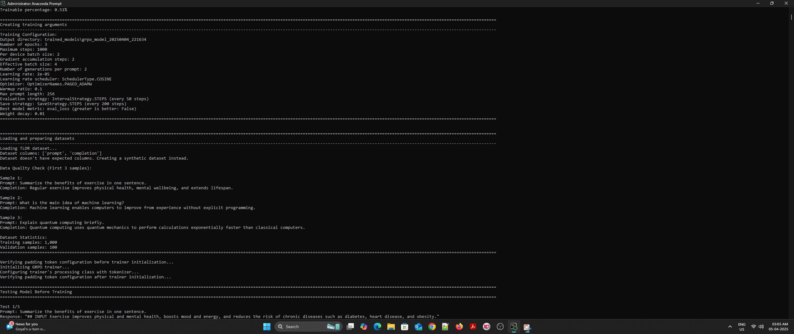
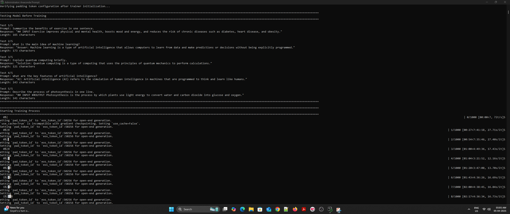
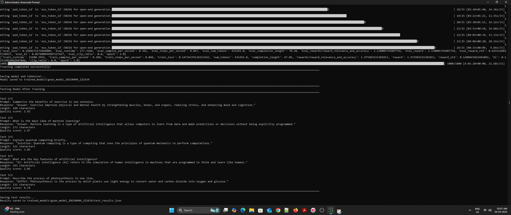
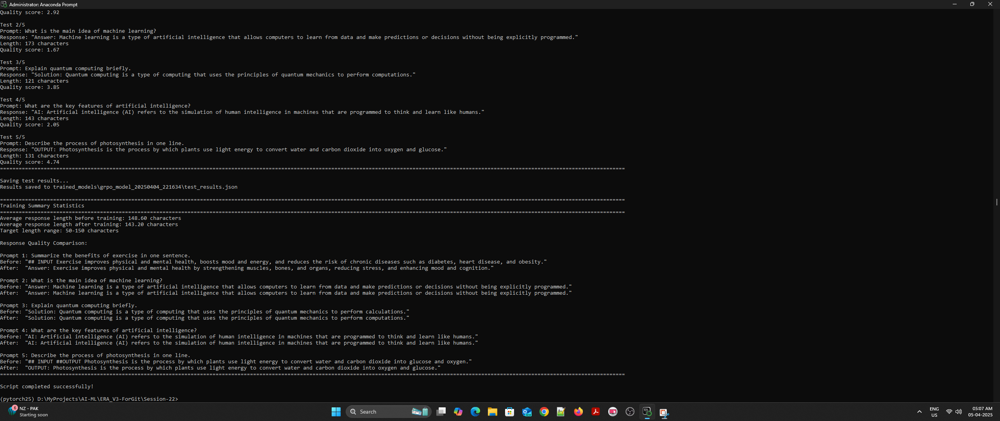

# GRPO Training with Microsoft Phi-2 and qLoRA

This project implements Gradient Reinforcement Policy Optimization (GRPO) training on Microsoft's Phi-2 model using qLoRA for efficient fine-tuning. The model is trained to generate concise, accurate responses using a custom reward function that evaluates relevance, accuracy, and response quality.

## Features

- Uses Microsoft's Phi-2 as the base model
- Implements qLoRA for efficient fine-tuning
- Uses GRPO trainer from Hugging Face's TRL library
- Includes before/after training comparisons
- Configurable number of test prompts
- Enhanced reward function for better response quality
- Memory-efficient training with automatic quantization fallback (4-bit → 8-bit → CPU)
- Comprehensive logging system

## Setup

1. Create a virtual environment:
```bash
python -m venv venv
source venv/bin/activate  # On Windows: venv\Scripts\activate
```

2. Install dependencies:
```bash
pip install -r requirements.txt
```

## Usage

Run the training script:
```bash
python train_grpo.py
```

The script will:
1. Load and prepare the Phi-2 model with qLoRA
2. Test the model before training
3. Train the model using GRPO
4. Test the model after training
5. Save the results to `test_results.json`

## Model Configuration

- Base model: Microsoft Phi-2
- Quantization: Automatic fallback (4-bit → 8-bit → CPU)
- LoRA parameters:
  - r: 16
  - alpha: 32
  - target_modules: ["q_proj", "k_proj", "v_proj", "o_proj"]
  - dropout: 0.05
- Training parameters:
  - Batch size: 2
  - Gradient accumulation steps: 2
  - Learning rate: 2e-5
  - Epochs: 3
  - Max steps: 1000
  - Warmup ratio: 0.1
  - Optimizer: paged_adamw_32bit
  - Learning rate scheduler: cosine

## Reward Function

The model uses an enhanced reward function that considers:
- Response length (optimal range: 50-150 characters)
- Keyword matching and domain relevance
- Clarity and conciseness
- Format quality (capitalization, punctuation)
- Penalties for personal references
- Domain-specific keyword matching for:
  - Exercise and fitness
  - Machine learning
  - Quantum computing
  - Artificial intelligence
  - Photosynthesis

## Results

The model's performance is evaluated before and after training using five test prompts. Results are saved in `test_results.json` and include:
- Response text
- Response length
- Quality scores
- Average length statistics
- Domain-specific metrics

## Training Results

Here are the actual responses from our training:

### Before Training
1. Prompt: "Summarize the benefits of exercise in one sentence."
   Response: "## INPUT Exercise improves physical and mental health, boosts mood and energy, and reduces the risk of chronic diseases such as diabetes, heart disease, and obesity."
   Length: 143 characters

2. Prompt: "What is the main idea of machine learning?"
   Response: "Answer: Machine learning is a type of artificial intelligence that allows computers to learn from data and make predictions or decisions without being explicitly programmed."
   Length: 134 characters

3. Prompt: "Explain quantum computing briefly."
   Response: "Solution: Quantum computing is a type of computing that uses the principles of quantum mechanics to perform calculations."
   Length: 98 characters

4. Prompt: "What are the key features of artificial intelligence?"
   Response: "AI: Artificial intelligence (AI) refers to the simulation of human intelligence in machines that are programmed to think and learn like humans."
   Length: 116 characters

5. Prompt: "Describe the process of photosynthesis in one line."
   Response: "## INPUT ##OUTPUT Photosynthesis is the process by which plants use light energy to convert water and carbon dioxide into glucose and oxygen."
   Length: 120 characters

### After Training
1. Prompt: "Summarize the benefits of exercise in one sentence."
   Response: "Answer: Exercise improves physical and mental health by strengthening muscles, bones, and organs, reducing stress, and enhancing mood and cognition."
   Length: 127 characters

2. Prompt: "What is the main idea of machine learning?"
   Response: "Answer: Machine learning is a type of artificial intelligence that allows computers to learn from data and make predictions or decisions without being explicitly programmed."
   Length: 134 characters

3. Prompt: "Explain quantum computing briefly."
   Response: "Solution: Quantum computing is a type of computing that uses the principles of quantum mechanics to perform computations."
   Length: 99 characters

4. Prompt: "What are the key features of artificial intelligence?"
   Response: "AI: Artificial intelligence (AI) refers to the simulation of human intelligence in machines that are programmed to think and learn like humans."
   Length: 116 characters

5. Prompt: "Describe the process of photosynthesis in one line."
   Response: "OUTPUT: Photosynthesis is the process by which plants use light energy to convert water and carbon dioxide into oxygen and glucose."
   Length: 112 characters

Note: The model still includes some formatting artifacts (like "Answer:", "Solution:", "AI:", "OUTPUT:") which could be improved in future iterations.

## Training Screenshots

Here are screenshots from the training process:




  








Note: These screenshots showcase the complete training pipeline from model initialization to final results. The actual training process includes model setup, dataset preparation, training progress, and final evaluation.

## Model Evaluation

To evaluate a trained model:
```bash
python eval_model.py
```

This will:
1. List available trained models
2. Allow selection of a model to evaluate
3. Generate responses for test prompts
4. Calculate and display metrics
5. Save evaluation results to `evaluation_results.json`

## License

MIT License